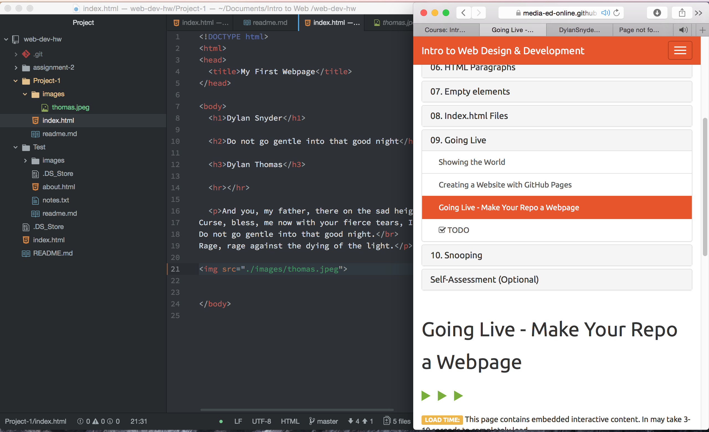

# Technical Report

I pretty much only use Safari. It uses a user interface which is what you see on screen. A rendering enginge which is what builds the dissplay of the page. Safari uses Webkit as their rendering enginge. A browser engigne directs communication between the interface, servers, and rendering enginge. The browsers communicates with the network to send and recieve info. There is also a Javascript inturpter so the browser can understand Javascript. Lastly there is data Storage in the form of, cookies and local storage. This save bits of data while you are using the browser.

Wayback Machine is awesome! I visted www.surfersjournal.com which is a surf publication from Australia. I visted a snapshot from march of 2000. I was surprised at the quality. It is basic but the layout is clean. There are a few goofy pictures on the side but overall pretty good for the times. Today the only thing the same is the menu across the top. The site is extremly organized and full of high quality pictures and video.

My work cycle for this project was broken into three parts. I had atom and the project description split screen. That way I could work on the page while seeing what exactly is needed. I also kept open on a seperate tab the course website. This way I could find how to do something. I would check test documents and previous assignment.

