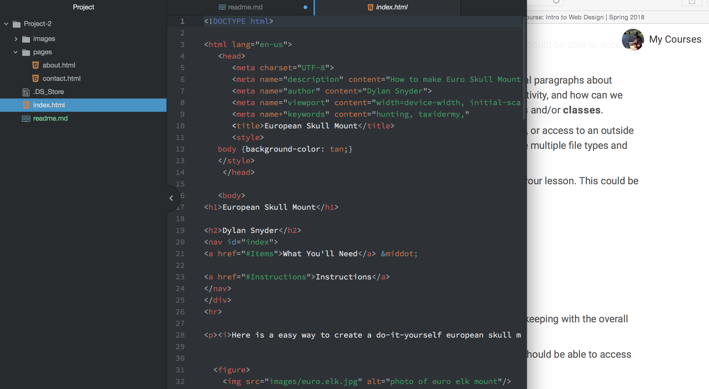

# Technical Report

Everything in HTML was totally new to me. I really enjoyed the process. There's a ton to learn but it is pretty straight forward. You do X and it creates Y.

I know nothing about CSS so I have no clue what to expect.

My work cycle for this project was a little different than the past few assignments. I picked a topic that I knew about. I did some research. I then preped my files. I refrenced the text book for almost everything I did for this project. I would also use the course website quite a bit.

