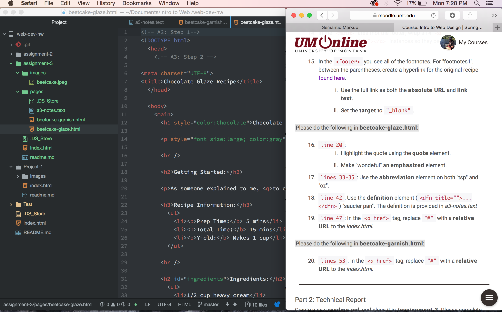

# Technical Report

1. A page can have one head and body element. The head element contains the metadata and processing informatin for the page. It communicates to the data to the browser. The body element contains what will be shown on the page. The language is communicated to the browser and displayed as written.

2.Structural markup essentially organize a page using different types of structural elements. Semantic markup is used inside of structural elements to highlight and give emphisis to certain parts.

3.My work cycle hasn't changed since project 1. I have atom and safari split screen. On safari I have tabs for the assignment page and the course website. I cycle through the three until I have the assignment complete.

