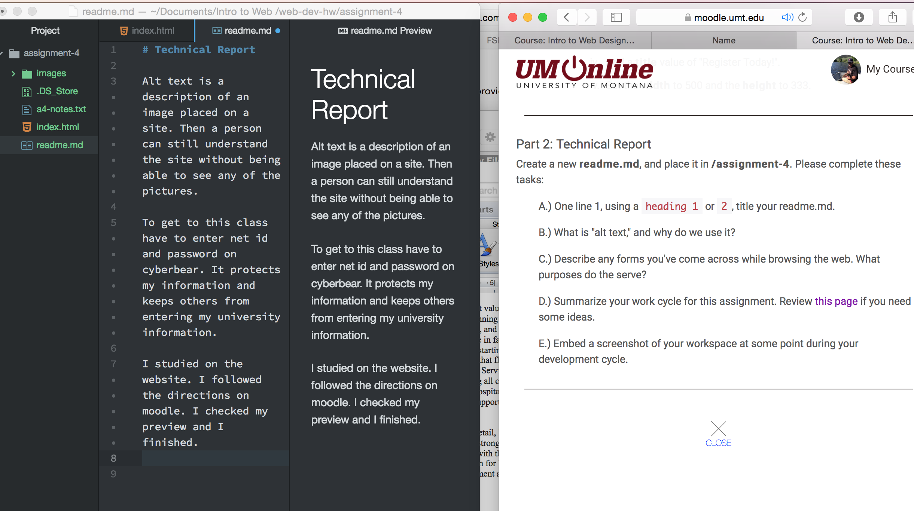

# Technical Report

Alt text is a description of an image placed on a site. Then a person can still understand the site without being able to see any of the pictures.

To get to this class have to enter net id and password on cyberbear. It protects my information and keeps others from entering my university information.

I studied on the website. I followed the directions on moodle. I checked my preview and I finished.

