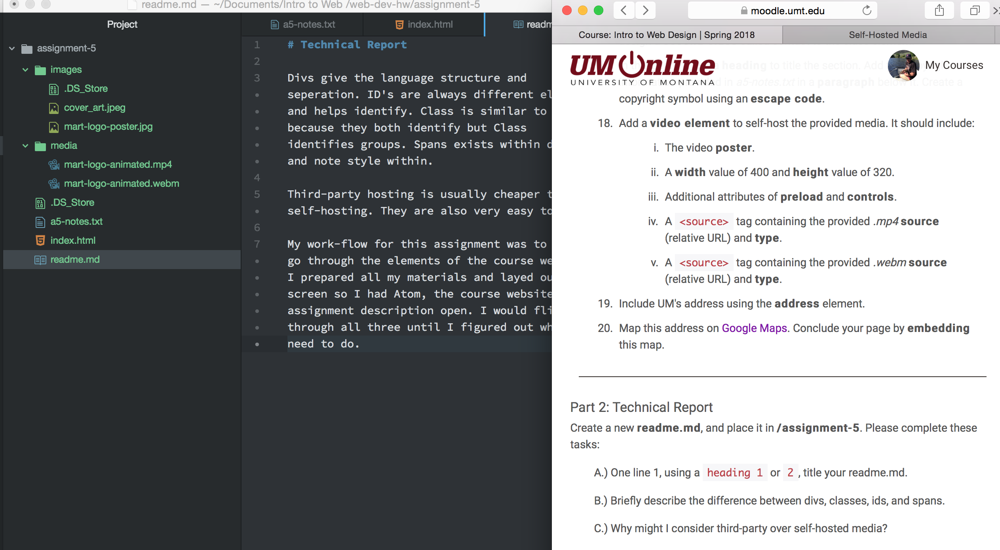

# Technical Report

Divs give the language structure and seperation. ID's are always different element and helps identify. Class is similar to ID's because they both identify but Class identifies groups. Spans exists within devs and note style within.

Third-party hosting is usually cheaper than self-hosting. They are also very easy to use.

My work-flow for this assignment was to first go through the elements of the course website. I prepared all my materials and layed out my screen so I had Atom, the course website, and assignment description open. I would flip through all three until I figured out what I need to do.

