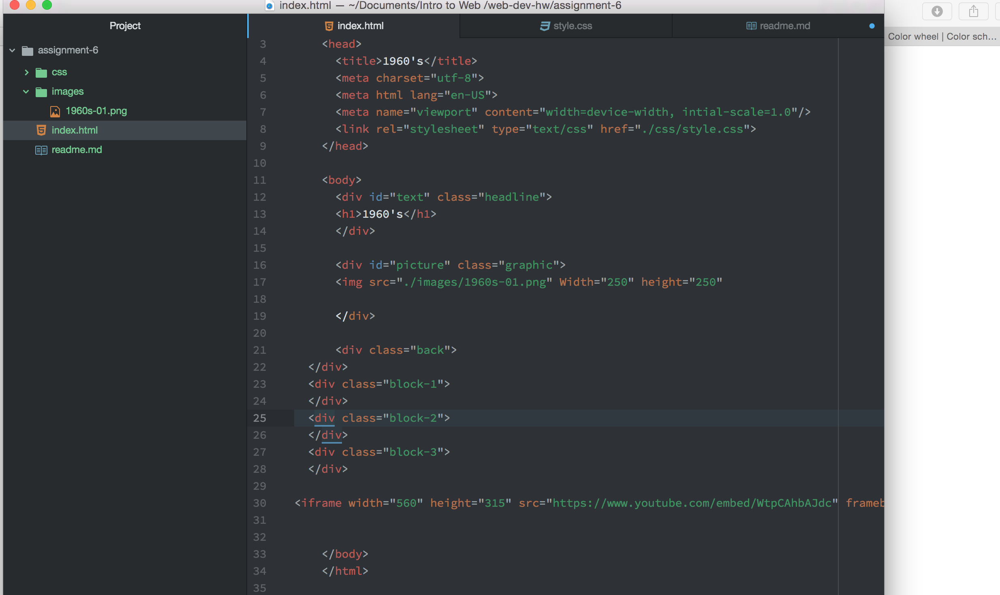

# Technical Report

I chose one of the 1960's graphic. I just tried to use colors of the time and try to get any design on there.

I went to color cc and found a 1960's color palette that I liked.

FCF4EA, B9FBF7, F9AD9D, FEEDC0, 549AA3

My work cycle for this assignment was to follow along with the directions while using the book and the class website for help.

