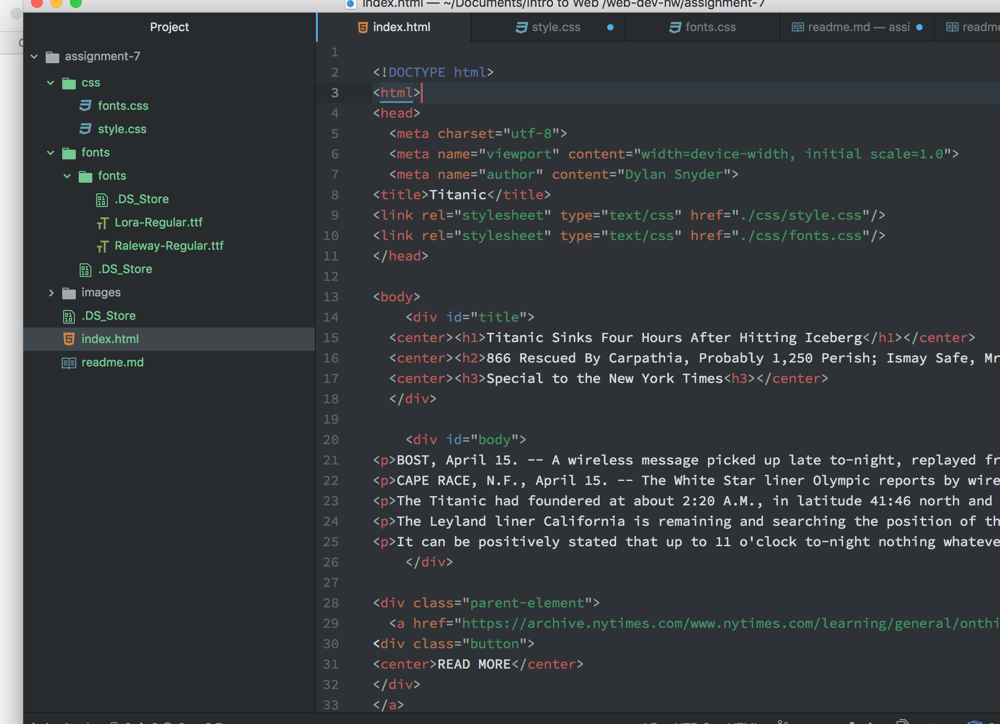

# Technical Report

I wanted to get a basic kind of dull feel because that what i think of with old newspapers. I chose a mix of serif and san-serif with the fonts Lora and Raleway.

System font is found on the local disk, Web font is found on servers, and web safe fonts are found on every computer.

My work cycle was to study on the class website. Then I had atom ope with the class site open. I would work between atom, the website, the textbook, and the assignment description.

