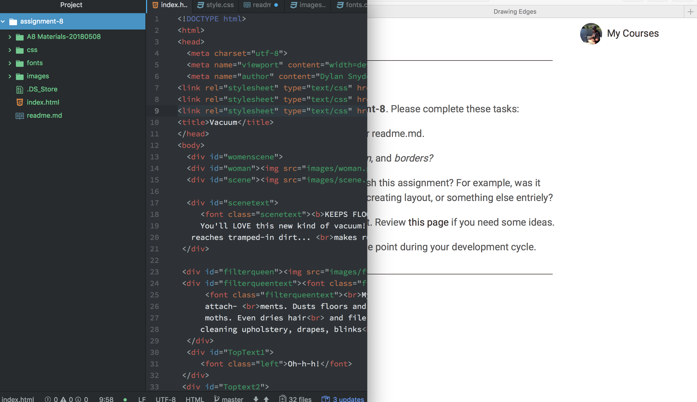

# Technical Report

Padding is the space between the border of an object and the content within the object.
Margin is the space between two elements.
Border is a container of an object.

The hardest task was styling. I have had alot of trouble with CSS. The positioning was where I failed completely. Even when I feel like I have something correct I preview it and its just not anything what I thought.

My work cycle for this assignment was to go between the course website, textbook, assignment, and a preview. I would cycle through them tell I thought I had something correct which most of it I didn't.

